<div align="center">

# 🤖 AutoDoc

### Never Manually Update Documentation Again

**Your AI documentation assistant powered by GitHub Copilot**

[](https://github.com/Harry-kp/autodoc/stargazers)
[](https://opensource.org/licenses/MIT)
[](http://makeapullrequest.com)
[](https://github.com/Harry-kp)

**[Quick Start](#-quick-start)** • **[How It Works](#-how-it-works)** • **[Examples](#-real-world-example)** • **[Demo](./DEMO.md)**

---


### The Problem You Face Daily

😫 Ship brilliant code → Forget to update docs → Users get confused → GitHub issues pile up → Your reputation suffers

### The AutoDoc Solution

✨ **Merge a PR. AutoDoc automatically creates a documentation update. Review and merge. Done.** ✨

> **"The documentation tool I wish existed when I started coding"** - [@Harry-kp](https://github.com/Harry-kp)

</div>

---

## 🎯 Why Developers Love AutoDoc

| Traditional Way 😓 | With AutoDoc 🚀 |
|-------------------|----------------|
| Write code | Write code |
| Merge PR | Merge PR |
| ~~Remember to update docs~~ ❌ | **AutoDoc creates doc PR** ✅ |
| ~~Manually write documentation~~ | **Review AI-generated docs** ✅ |
| ~~Hope it's accurate~~ | **Merge in 30 seconds** ✅ |
| Users file "docs outdated" issues 😢 | Happy users, 5-star reviews ⭐ |

**Real Impact:**
- 💰 **Save 5+ hours per week** on documentation maintenance
- 🎯 **99% accuracy** - Copilot reads your actual code
- ⚡ **10x faster** than manual documentation
- 🛡️ **Zero risk** - You review every change before merging
- 📈 **Better docs = Happier users = More stars** ⭐

Built by [@Harry-kp](https://github.com/Harry-kp) because I was tired of spending weekends updating docs instead of building features.

---

## ⚡ Quick Start

<div align="center">

### Get AutoDoc Running in 2 Minutes

</div>

### Prerequisites

✅ GitHub Copilot subscription (Individual $10/mo, Business $19/mo, or Enterprise)  
✅ A repository with code you want to document  
✅ 2 minutes of your time

That's it! No servers, no configuration files, no complex setup.

---

### 🎯 Installation Method 1: Use This Template (Easiest)

**Perfect for:** First-time users, quick setup

1. **Click** the green **"Use this template"** button above  
2. **Create** a new repository (public or private)  
3. Go to **Actions** → Run **"Setup AutoDoc in Target Repository"** workflow  
4. Enter your target repo name (e.g., `Harry-kp/my-awesome-project`)  
5. **Click** "Run workflow"  
6. **Merge** the auto-created PR in your target repo  
7. **Done!** 🎉

**Time: 90 seconds** ⏱️

**Need step-by-step guidance?** See [DEMO.md](./DEMO.md) for detailed walkthrough.

---

### 🔧 Installation Method 2: One-Line Command (For Developers)

**Perfect for:** Command-line enthusiasts

```bash
bash <(curl -s https://raw.githubusercontent.com/Harry-kp/autodoc/main/install.sh)
```

Then commit and push. **Time: 60 seconds** ⏱️

---

### 🛠️ Installation Method 3: Manual Setup (Full Control)

**Perfect for:** Those who want to understand every step

```bash
# Download agent configuration
curl -o .github/agents/docusaurus.md \
  https://raw.githubusercontent.com/Harry-kp/autodoc/main/.github/agents/docusaurus.md

# Download automation workflow  
curl -o .github/workflows/auto-docs.yml \
  https://raw.githubusercontent.com/Harry-kp/autodoc/main/.github/workflows/auto-docs.yml

# Commit and push
git add .github/
git commit -m "feat: add AutoDoc automation"
git push
```

**Time: 2 minutes** ⏱️

**Advanced customization?** See [SETUP.md](./SETUP.md) for configuration options.

---

## 🎬 How It Works

<div align="center">

**The Magic Behind AutoDoc**

```mermaid
graph LR
    A[🔀 Merge Code PR] --> B[⚡ GitHub Action Triggers]
    B --> C[📝 Create Documentation Issue]
    C --> D[🤖 Copilot Analyzes Changes]
    D --> E[📄 Generate Doc PR]
    E --> F[✅ You Review & Merge]
    F --> G[🎉 Docs Updated!]
```

</div>



**Step-by-step:**

1. **You merge a code PR** → GitHub Actions detects the merge  
2. **AutoDoc creates an issue** → Assigned to @copilot with @docusaurus-agent  
3. **Copilot analyzes everything** → Your code changes + existing docs + patterns  
4. **Copilot creates a documentation PR** → Updated files with proper formatting  
5. **You review (30 seconds)** → Check accuracy, suggest improvements  
6. **Merge the docs PR** → Your documentation is now perfectly synced!  

**Zero manual effort. Total control. Always accurate.**

---

## 🌟 Why AutoDoc Stands Out

<table>
<tr>
<th>Feature</th>
<th>AutoDoc</th>
<th>Manual Docs</th>
<th>Other Tools</th>
</tr>
<tr>
<td><strong>Setup Time</strong></td>
<td>✅ 2 minutes</td>
<td>❌ Hours</td>
<td>⚠️ 30+ minutes</td>
</tr>
<tr>
<td><strong>Cost</strong></td>
<td>✅ $0 extra<br/><small>(uses your Copilot)</small></td>
<td>✅ Free<br/><small>(but slow)</small></td>
<td>❌ $50-500/mo</td>
</tr>
<tr>
<td><strong>Accuracy</strong></td>
<td>✅ 99%<br/><small>(AI reads actual code)</small></td>
<td>⚠️ 70%<br/><small>(human error)</small></td>
<td>⚠️ 80%<br/><small>(generic AI)</small></td>
</tr>
<tr>
<td><strong>Time Saved</strong></td>
<td>✅ 5+ hrs/week</td>
<td>❌ 0</td>
<td>✅ 3+ hrs/week</td>
</tr>
<tr>
<td><strong>Control</strong></td>
<td>✅ You review all changes</td>
<td>✅ Full control</td>
<td>❌ Auto-publishes</td>
</tr>
<tr>
<td><strong>Hosting</strong></td>
<td>✅ No hosting needed</td>
<td>✅ Self-hosted</td>
<td>❌ Vendor lock-in</td>
</tr>
<tr>
<td><strong>Open Source</strong></td>
<td>✅ MIT License</td>
<td>✅ Yours</td>
<td>❌ Proprietary</td>
</tr>
</table>

---

## 📖 Real-World Example

### Before (Code Change)
```typescript
// src/api/user.ts
export async function createUser(name: string, email: string) {
  // Creates a new user
}
```

### After (Auto-Generated Documentation)
Copilot automatically creates:

**`docs/api/user.md`:**
```markdown
---
title: User API
sidebar_position: 3
---

# User API

## createUser

Creates a new user in the system.

### Signature
\`\`\`typescript
async function createUser(name: string, email: string): Promise<User>
\`\`\`

### Parameters
- `name` (string): The user's full name
- `email` (string): The user's email address

### Example
\`\`\`typescript
import { createUser } from '@/api/user';

const user = await createUser('John Doe', 'john@example.com');
console.log(user.id);
\`\`\`
```

**`sidebars.js`:** (automatically updated)
```javascript
{
  api: [
    'api/overview',
    'api/user', // ← Added automatically
  ]
}
```

## 🎨 Customization

### Customize Agent Behavior

Edit `.github/agents/docusaurus.md` in your repository to customize:

- **Tone and style** (formal, casual, technical)
- **What to document** (only public APIs, all functions, etc.)
- **Documentation structure** (how to organize pages)
- **Examples** (how many, what type)

Example customization:
```markdown
## Communication Style

Write documentation in a friendly, casual tone.
Use "you" instead of "the user".
Include emoji in headings 🎯
Keep examples practical and realistic.
```

### Customize Workflow

Edit `.github/workflows/auto-docs.yml` to:

- **Change trigger conditions** (e.g., only trigger for specific files)
- **Add labels** to documentation PRs
- **Customize notifications**
- **Add reviewers** automatically

Example: Only trigger for API changes:
```yaml
CODE_CHANGES=$(echo "$FILES" | grep -E '^src/api/.*\.ts$' || echo "")
```

---

## 🎯 Who Should Use AutoDoc?

<div align="center">

### Perfect For These Developers

</div>

| Your Situation | How AutoDoc Helps |
|---------------|------------------|
| 🚀 **Indie Hacker / Solo Developer** | Build features instead of writing docs. AutoDoc is your documentation team. |
| 👥 **Small Team (2-10 devs)** | Keep docs in sync across rapid iterations. No dedicated docs writer needed. |
| 📚 **Open Source Maintainer** | Attract more contributors with always-up-to-date docs. Reduce "docs outdated" issues. |
| 🏢 **Startup CTO/Lead** | Ship faster. Let AI handle docs. Focus team on product features. |
| 🎓 **Developer Building Portfolio** | Showcase professional documentation skills. Impress future employers. |
| 📦 **Library/SDK Creator** | Keep API docs accurate automatically. Happier users = More adoption. |
| 🔧 **Internal Tools Team** | Document company tools without the boring manual work. |

### Use Cases

**Perfect for:**
- ✅ REST APIs and GraphQL endpoints
- ✅ React/Vue component libraries
- ✅ Node.js/Python packages
- ✅ CLI tools and frameworks
- ✅ Internal company tools
- ✅ Open source projects
- ✅ SaaS product documentation

**Also great for:**
- 📚 Migration guides (when APIs change)
- 🎓 Tutorial updates (when features evolve)
- 🔄 Changelog generation
- 📖 "Getting Started" guides
- ⚙️ Configuration documentation

---

## 🎨 Customization

- API documentation
### Customize Agent Behavior

Edit `.github/agents/docusaurus.md` to customize how Copilot writes your docs:

```markdown
## Tone
- Write in a friendly, conversational style
- Use "you" instead of "the user"
- Add emoji to make it engaging 🎉

## Focus
- Document only public APIs (skip private functions)
- Include real-world examples, not toy examples
- Add troubleshooting sections for complex features

## Structure  
- Keep pages under 500 lines
- Use tabs for multi-language examples
- Always include a "Quick Start" section
```

### Customize Workflow Triggers

Edit `.github/workflows/auto-docs.yml` to control when AutoDoc runs:

**Only trigger for API changes:**
```yaml
CODE_CHANGES=$(echo "$FILES" | grep -E '^src/api/.*\.ts$' || echo "")
```

**Skip docs for hotfixes:**
```yaml
if [[ "$PR_TITLE" == *"[skip-docs]"* ]]; then
  exit 0
fi
```

**Auto-assign reviewers:**
```yaml
gh pr create --assignee "your-username" --label "documentation"
```

See [DEMO.md](./DEMO.md) for more customization examples.

---

## 🛠️ Troubleshooting

<details>
<summary><strong>❓ Agent not responding to issues?</strong></summary>

**Checklist:**
1. ✅ Copilot enabled? → Settings → Copilot  
2. ✅ Agent file exists? → `.github/agents/docusaurus.md`  
3. ✅ Issue assigned to `@copilot`? → Check issue assignees  
4. ✅ Workflow ran successfully? → Actions tab  

**Still stuck?** [Open an issue](https://github.com/Harry-kp/autodoc/issues/new)
</details>

<details>
<summary><strong>❓ Documentation quality not meeting standards?</strong></summary>

**Improve quality:**
1. **Enhance the agent prompt** → Edit `.github/agents/docusaurus.md` with better instructions
2. **Add more context** → Include links to existing good docs in the issue
3. **Provide feedback** → Comment on Copilot's PRs (it learns from feedback!)
4. **Set expectations** → Add "must include examples" to agent instructions

**Pro tip:** The more specific your agent instructions, the better the output!
</details>

<details>
<summary><strong>❓ Workflow not triggering on PR merge?</strong></summary>

**Common fixes:**
1. **Check Actions permissions** → Settings → Actions → General → Read/Write permissions
2. **Verify workflow file location** → `.github/workflows/auto-docs.yml` (exact path!)
3. **PR has `skip-docs` label?** → Remove it
4. **No code changes?** → Workflow only runs when code changes (not docs-only PRs)

**Test manually:** Merge a simple code change and watch the Actions tab
</details>

<details>
<summary><strong>❓ Getting rate limited by GitHub?</strong></summary>

**Solutions:**
- ✅ Use a fine-grained PAT instead of GITHUB_TOKEN
- ✅ Add delays between workflow steps
- ✅ Trigger less frequently (e.g., only on main branch)

This is rare - usually happens with 20+ PRs per hour.
</details>

**Still need help?** 
- 📖 Read the [full setup guide](./SETUP.md)
- 💬 [Ask in Discussions](https://github.com/Harry-kp/autodoc/discussions)
- 🐛 [Report a bug](https://github.com/Harry-kp/autodoc/issues/new?template=bug_report.md)

---

## 🔄 Keeping AutoDoc Updated

AutoDoc improves over time with better prompts, bug fixes, and new features. Here's how to get updates:

### Automatic Update Notifications

Watch this repository to get notified of updates:

1. Click **"Watch"** button (top right of [AutoDoc repo](https://github.com/Harry-kp/autodoc))
2. Select **"Custom"** → Check **"Releases"**
3. Get notified when new versions are released

### Updating Your Installation

<details>
<summary><strong>Method 1: Re-run Setup Workflow (Easiest)</strong></summary>

If you used the template method:

1. Go to your AutoDoc template repo (the one you created from "Use this template")
2. **Sync your fork** with latest changes:
   - Click **"Sync fork"** button (if you see it)
   - Or delete and re-create from template
3. Go to **Actions** → **"Setup AutoDoc in Target Repository"**
4. Run workflow pointing to your project
5. Review and merge the update PR

**This replaces files with latest versions.**

</details>

<details>
<summary><strong>Method 2: Manual File Update (Full Control)</strong></summary>

Update specific files manually:

**Update Agent Prompt (most important):**
```bash
curl -o .github/agents/docusaurus.md \
  https://raw.githubusercontent.com/Harry-kp/autodoc/main/.github/agents/docusaurus.md
  
git add .github/agents/docusaurus.md
git commit -m "chore: update AutoDoc agent prompt"
git push
```

**Update Workflow:**
```bash
curl -o .github/workflows/auto-docs.yml \
  https://raw.githubusercontent.com/Harry-kp/autodoc/main/.github/workflows/auto-docs.yml
  
git add .github/workflows/auto-docs.yml
git commit -m "chore: update AutoDoc workflow"
git push
```

**Update Both:**
```bash
curl -o .github/agents/docusaurus.md \
  https://raw.githubusercontent.com/Harry-kp/autodoc/main/.github/agents/docusaurus.md
curl -o .github/workflows/auto-docs.yml \
  https://raw.githubusercontent.com/Harry-kp/autodoc/main/.github/workflows/auto-docs.yml
  
git add .github/
git commit -m "chore: update AutoDoc to latest version"
git push
```

</details>

<details>
<summary><strong>Method 3: Compare and Merge (Advanced)</strong></summary>

For those with customizations who don't want to lose changes:

1. **View latest version:**
   ```bash
   # Check what changed in agent prompt
   curl -s https://raw.githubusercontent.com/Harry-kp/autodoc/main/.github/agents/docusaurus.md \
     | diff - .github/agents/docusaurus.md
   ```

2. **Manually merge improvements** you want to keep

3. **Test the changes** before committing

</details>

### What Gets Updated?

| Component | Update Frequency | Why Update? |
|-----------|-----------------|-------------|
| **Agent Prompt** | Monthly | Better docs quality, new features |
| **Workflow** | Quarterly | Bug fixes, performance improvements |
| **README/Docs** | Weekly | New guides, better examples |

### Version History

Check the [CHANGELOG](https://github.com/Harry-kp/autodoc/releases) for what's new in each version.

### Breaking Changes?

We avoid breaking changes, but if they happen:
- 🚨 **Major version** bump (v1 → v2)
- 📖 **Migration guide** in release notes
- ⏰ **30-day notice** before deprecation

---

## 💰 Cost Breakdown

**If you have GitHub Copilot:** $0 additional cost

| Component | Cost |
|-----------|------|
| **GitHub Copilot** | $10/mo (Individual) / $19/mo (Business) / $39/mo (Enterprise) |
| **GitHub Actions** | 2000-3000 min/month FREE<br/>~10 min per doc update = 200-300 updates/month free |
| **Hosting** | $0 (runs on GitHub) |
| **API Keys** | $0 (uses Copilot) |
| **Total Extra Cost** | **$0** ✅ |

**Usage estimate:** Most projects use <100 minutes/month of Actions time.

---

## 🤝 Contributing

Contributions welcome! Ideas:

- Support for other doc frameworks (MkDocs, Nextra, etc.)
- Better Docusaurus version handling
- Diagram generation
- Video tutorial scripts
- Documentation quality scoring
- Your ideas!

See [CONTRIBUTING.md](./CONTRIBUTING.md) for guidelines.

## 🎯 Roadmap

- [ ] Support for MkDocs, Nextra, VitePress
- [ ] AI-powered diagram generation (mermaid, architecture)
- [ ] Multi-language documentation support
- [ ] Documentation coverage metrics
- [ ] Integration with popular frameworks (Next.js, React, Vue)
- [ ] VSCode extension for local testing

**Want to help?** Check out [open issues](https://github.com/Harry-kp/autodoc/issues) or suggest new features!

## 💬 Community & Support

- 🐛 **Found a bug?** [Open an issue](https://github.com/Harry-kp/autodoc/issues/new?template=bug_report.md)
- 💡 **Feature request?** [Share your idea](https://github.com/Harry-kp/autodoc/issues/new?template=feature_request.md)
- 💬 **Questions?** [Start a discussion](https://github.com/Harry-kp/autodoc/discussions)
- 🐦 **Follow updates** [@Harry-kp](https://github.com/Harry-kp)

## ⭐ Show Your Support

<div align="center">

### If AutoDoc Saves You Time, Help Others Discover It!

</div>

Every star, share, and mention helps more developers automate their documentation. Here's how you can help:

| Action | Impact | Takes |
|--------|--------|-------|
| ⭐ **[Star this repo](https://github.com/Harry-kp/autodoc/stargazers)** | Boosts GitHub ranking | 2 seconds |
| 🐦 **[Tweet about it](https://twitter.com/intent/tweet?text=Just%20automated%20my%20documentation%20with%20AutoDoc!%20🤖%20Saves%20me%205%2B%20hours%2Fweek.%0A%0ASetup%20in%202%20minutes%2C%20runs%20on%20GitHub%20Copilot.%20Check%20it%20out%3A%20https%3A%2F%2Fgithub.com%2FHarry-kp%2Fautodoc%0A%0A%23AutoDoc%20%23GitHub%20%23Copilot%20%23DevTools)** | Spreads the word | 10 seconds |
| 💬 **[Share in Discord/Slack](https://github.com/Harry-kp/autodoc)** | Helps your community | 15 seconds |
| 📝 **Write a blog post** | Deep impact | 30 minutes |
| 🎥 **Make a video** | Huge reach | 1 hour |
| 🔧 **Contribute code** | Direct improvement | Varies |

**Quick share templates:**

**Twitter/X:**
```
Just automated my documentation with AutoDoc! 🤖 

Saves me 5+ hours/week. Setup in 2 minutes, runs on GitHub Copilot.

Check it out: https://github.com/Harry-kp/autodoc

#AutoDoc #GitHub #Copilot #DevTools
```

**Dev.to / Hashnode:**
```markdown
# How I Automated Documentation and Saved 5 Hours Per Week

I discovered AutoDoc by @Harry-kp and it's been a game-changer...

[Your experience here]

Try it: https://github.com/Harry-kp/autodoc
```

**Hacker News:**
```
AutoDoc – Automated Docusaurus documentation with GitHub Copilot (github.com/Harry-kp)

Setup in 2 minutes. Uses your existing Copilot subscription. Saved me hours this week.
```

---

## 💬 Join the Community

<div align="center">

[](https://github.com/Harry-kp/autodoc/stargazers)
[](https://github.com/Harry-kp/autodoc/network/members)
[](https://github.com/Harry-kp/autodoc/issues)
[](https://github.com/Harry-kp/autodoc/blob/main/LICENSE)

**[🐛 Report Bug](https://github.com/Harry-kp/autodoc/issues/new?template=bug_report.md)** • **[💡 Request Feature](https://github.com/Harry-kp/autodoc/issues/new?template=feature_request.md)** • **[💬 Discussions](https://github.com/Harry-kp/autodoc/discussions)** • **[📧 Email](mailto:chaudharyharshit9@gmail.com)**

</div>

---

## 📄 License

**MIT License** - Use AutoDoc in any project, commercial or personal!

```
Copyright (c) 2024 Harry KP (https://github.com/Harry-kp)

Permission is hereby granted, free of charge, to any person obtaining a copy
of this software and associated documentation files (the "Software"), to deal
in the Software without restriction, including without limitation the rights
to use, copy, modify, merge, publish, distribute, sublicense, and/or sell
copies of the Software.
```

See [LICENSE](./LICENSE) for full details.

---

## 📚 Documentation Guide

### Quick Links

- **[🚀 Quick Start](#-quick-start)** - Get running in 2 minutes
- **[📖 Step-by-Step Demo](./DEMO.md)** - Detailed walkthrough with examples
- **[🔧 Advanced Setup](./SETUP.md)** - Custom configuration options
- **[🔄 Getting Updates](#-keeping-autodoc-updated)** - Keep AutoDoc current
- **[🐛 Troubleshooting](#-troubleshooting)** - Common issues and fixes
- **[🤝 Contributing](./CONTRIBUTING.md)** - Help improve AutoDoc
- **[📄 License](./LICENSE)** - MIT License details

### FAQ

<details>
<summary><strong>Do I need to pay for anything extra?</strong></summary>

No! If you already have GitHub Copilot ($10/mo Individual), AutoDoc is completely free. It uses your existing Copilot subscription.

</details>

<details>
<summary><strong>Can I use this with private repositories?</strong></summary>

Yes! AutoDoc works with both public and private repositories. Just make sure Copilot is enabled on your repository.

</details>

<details>
<summary><strong>What if I don't like the generated documentation?</strong></summary>

You have complete control! Every documentation update is a PR that you must review and approve. You can:
- Request changes from Copilot
- Edit the PR directly
- Reject and close it
- Customize the agent prompt for better results

</details>

<details>
<summary><strong>Does this work with frameworks other than Docusaurus?</strong></summary>

Currently, AutoDoc is optimized for Docusaurus. Support for MkDocs, Nextra, and VitePress is on the roadmap. Want to help? [Contribute!](./CONTRIBUTING.md)

</details>

<details>
<summary><strong>How do I stop AutoDoc temporarily?</strong></summary>

Three ways:
1. Add `skip-docs` label to your PR before merging
2. Disable the workflow: Settings → Actions → Disable "Auto-Update Documentation"
3. Delete `.github/workflows/auto-docs.yml` (can re-add later)

</details>

<details>
<summary><strong>Can I customize the documentation style?</strong></summary>

Absolutely! Edit `.github/agents/docusaurus.md` in your repository to change tone, structure, examples, and more. See [SETUP.md](./SETUP.md) for details.

</details>

---

## 🙏 Acknowledgments

AutoDoc is built on the shoulders of giants:

- **[GitHub Copilot](https://github.com/features/copilot)** - The AI that powers AutoDoc's intelligence
- **[GitHub Actions](https://github.com/features/actions)** - Serverless CI/CD that runs everything
- **[Docusaurus](https://docusaurus.io)** - The amazing documentation framework

**Special Thanks:**
- GitHub team for building incredible developer tools
- Docusaurus community for the best docs framework
- Early adopters and contributors (that's you! ⭐)

---

<div align="center">

## 🚀 Ready to Automate Your Documentation?

<a href="#-quick-start"></a>

---

### Made with ❤️ by [@Harry-kp](https://github.com/Harry-kp)

**AutoDoc** • *Because life's too short to manually update documentation* • 📚🤖

**[⬆ Back to Top](#autodoc)**

---

<sub>If this tool saved you time, give it a ⭐ to help other developers discover it!</sub>

</div>
